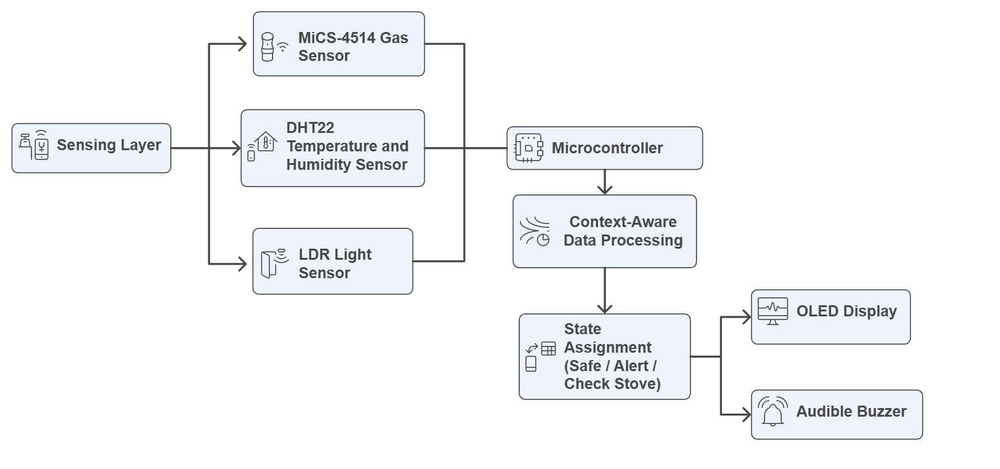
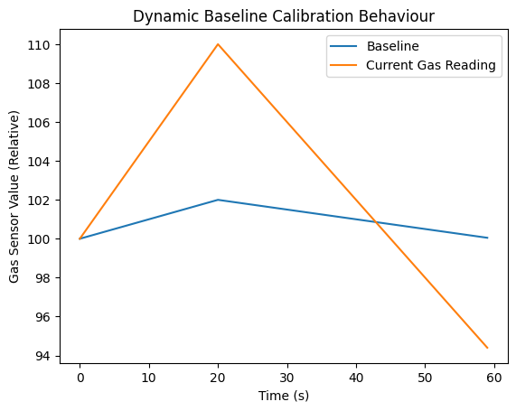
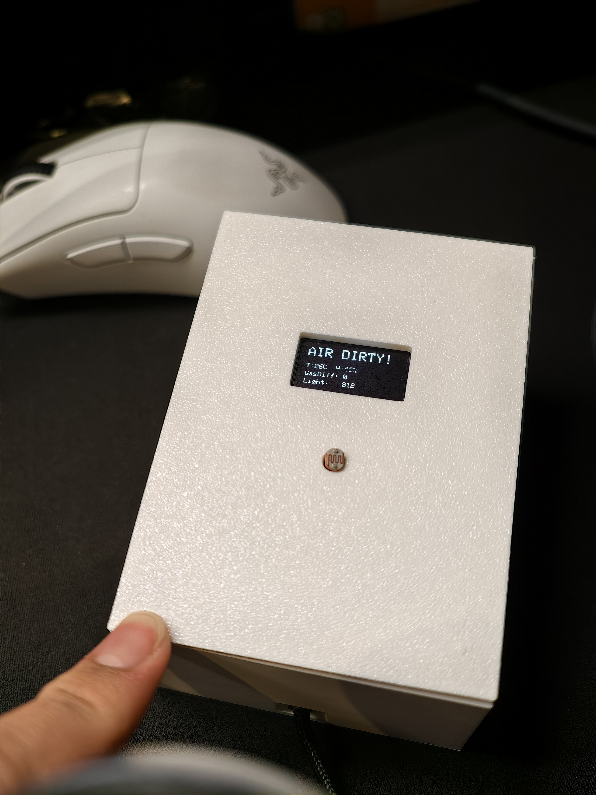

# Kitchen Safety Monitor

A context-aware kitchen safety monitoring system developed as part of the CASA0016 coursework.  
The system combines multiple low-cost sensors and simple decision logic to distinguish between
normal cooking activity and potentially hazardous situations, while reducing false alarms.

---

## Overview

Domestic kitchens are dynamic environments where normal cooking activities can easily trigger
nuisance alarms. This project explores a lightweight, context-aware approach to kitchen safety
monitoring by combining gas sensing, temperature monitoring, ambient light detection, and
time-based decision logic.

---

## System Features

- Dynamic gas baseline calibration to reduce sensor drift
- Multi-sensor fusion (gas, temperature, light)
- Context-aware logic for user presence estimation
- Persistence-based alert triggering to avoid false alarms
- Real-time status display on OLED
- Audible alert for hazardous conditions

---

## Hardware Components

- Arduino MKR WiFi 1010
- MiCS-4514 gas sensor (I²C)
- DHT22 temperature and humidity sensor
- LDR (ambient light sensing)
- OLED display (I²C)
- Active buzzer
- Breadboard and jumper wires
- 3D-printed enclosure

---

## System Architecture

---

## Decision Logic

The system uses simple state-based logic:

- **Safe**: normal activity detected
- **Check Stove**: gas detected while ambient light is low (possible user absence)
- **Alert**: sustained high temperature or heavy gas pollution

Alert conditions must persist for approximately **1.5 seconds** before triggering the buzzer.

---

## Dynamic Baseline Calibration

The gas sensor is used for **relative change**, not absolute concentration.
A baseline is set after warm-up and only updates when air returns to cleaner conditions.

---

## Prototype

---

## Repository Structure

    .
    0016_Kitchen_Monitor/
    ├─ images/
    │  ├─ baseline_calibration.png
    │  ├─ prototype.jpg
    │  └─ system_architecture.png
    ├─ 0016_Kitchen_Monitor.ino
    ├─ README.md

---

## Usage

1. Connect sensors and modules (I²C + analog + digital)
2. Upload the Arduino sketch to the MKR1010
3. Power via USB
4. Wait for gas sensor warm-up
5. Check OLED status and test buzzer alert

---

## Notes

- Thresholds were tuned empirically during testing
- Power numbers are approximate (datasheet + typical use)
- This is a coursework prototype for demonstration

---

## Author

Yewei Bian
